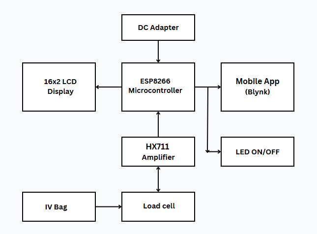
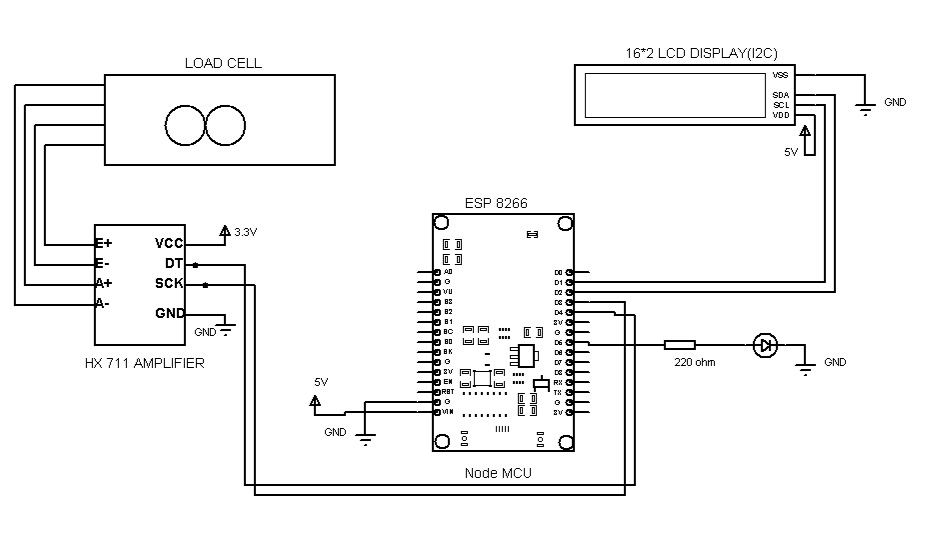
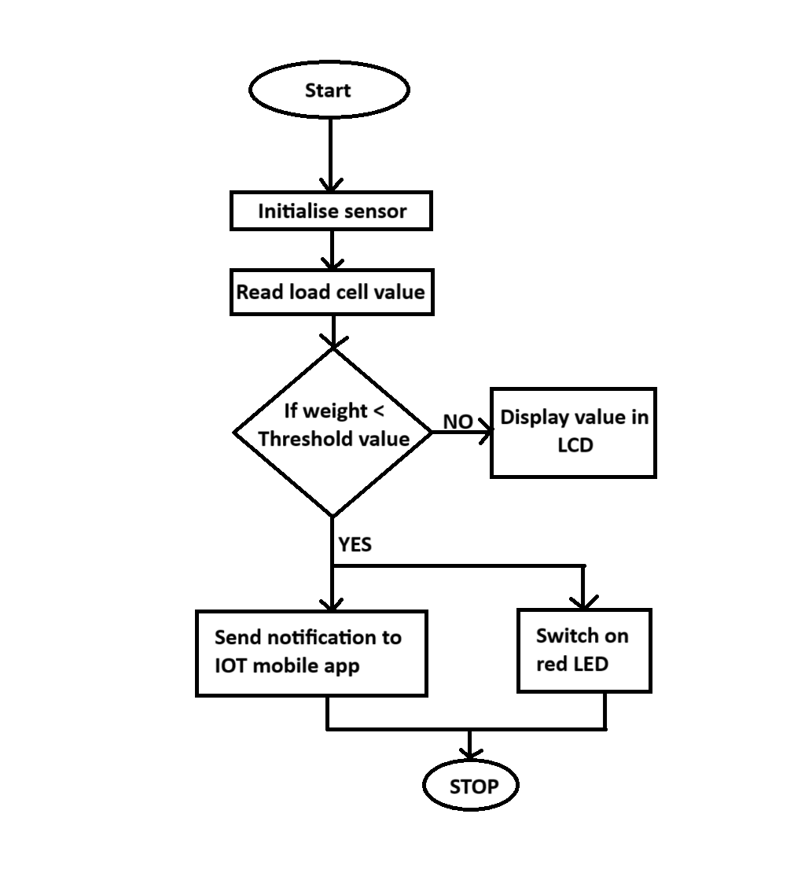
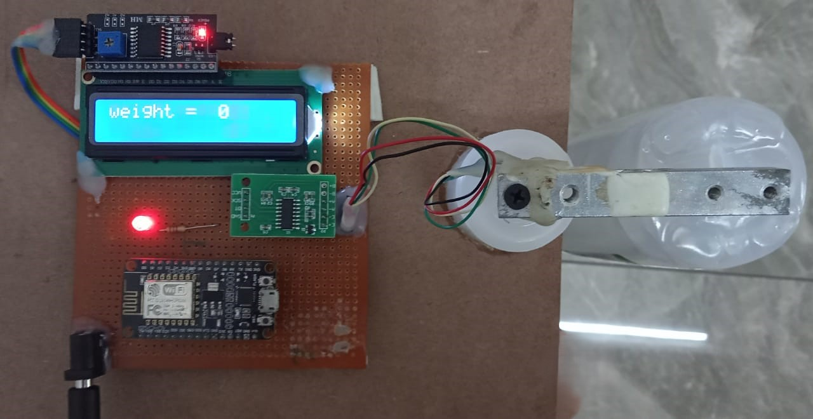
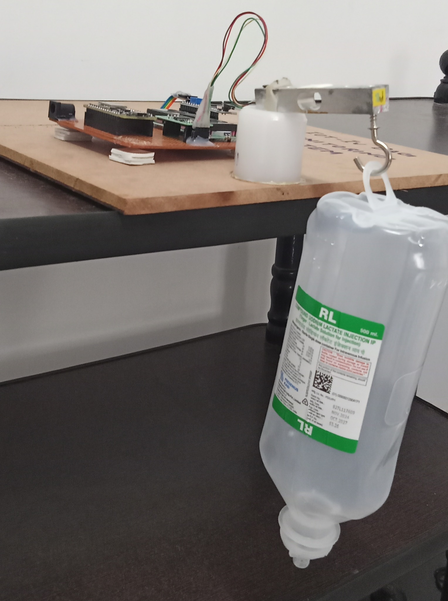

# 💧 IoT-based IV Bag Monitoring System

## 📌 Project Overview

This project presents an **IoT-based Intravenous (IV) Bag Monitoring System** to continuously monitor IV fluid levels. The system uses a load cell to measure the weight of the IV bag and transmits real-time data through Wi-Fi using the ESP8266. Alerts are sent to a mobile app when the fluid level is critically low, improving patient care and reducing manual workload for nurses.

> 🔍 This project was presented online at the **International Conference on Advancement in Science, Engineering & Technology (ICASET)** and is expected to be uploaded officially soon.

---

## 👨‍🔬 Team Members

- Arya Sasikumar *(Team Lead)*
- Gowthami S
- Mahitha M
- Ajmal TA

---

## 🛠️ Features

- Real-time IV fluid level monitoring using a load cell
- Automatic alert through Blynk IoT platform
- LCD display for live data feedback
- LED indicator for low fluid level
- Wireless communication via ESP8266

---

## 🔧 Components Used

| Component                | Description                          |
|--------------------------|--------------------------------------|
| ESP8266 Wi-Fi Module     | For internet connectivity            |
| HX711 Amplifier          | Interface for the load cell          |
| Load Cell                | Measures IV bag weight               |
| 16x2 LCD with I2C        | Displays the weight                  |
| LED                      | Alert indicator                      |
| Breadboard & Power Supply| Circuit setup                        |

---

## 📷 Block Diagram



---

## 🔌 Circuit Diagram



---

## 🔁 Flowchart



---

## ⚙️ Real Setup



---

## 📊 Output Dashboard



---

## 🚀 Working Process

1. Load cell continuously measures the IV bag weight.
2. ESP8266 processes and sends data to the Blynk app.
3. If weight drops below threshold:
   - An alert is pushed to the mobile app.
   - A red LED is turned ON.
   - LCD displays the current weight.

---

## 🗃️ Folder Structure

```
📦 IoT-IV-Bag-Monitoring
 ┣ 📂 code
 ┃ ┗ 📄 main.ino
 ┣ 📂 diagrams
 ┃ ┣ 📄 block_diagram.png
 ┃ ┣ 📄 circuit_diagram.jpg
 ┃ ┗ 📄 flowchart.png
 ┣ 📂 outputs
 ┃ ┣ 📄 output_dashboard.jpg
 ┃ ┗ 📄 setup_view.jpg
 ┗ 📄 README.md
```

---

## 🔮 Future Scope

- Integrate more sensors (heart rate, temperature).
- Add SMS or email alerts.
- Store historical data in cloud dashboard.
- Implement battery-powered portable version.

---

## 📬 Contact

📧 Email: aryasasi123@gmail.com  
🌐 GitHub: [YourGitHubUsername](https://github.com/YourGitHubUsername)

